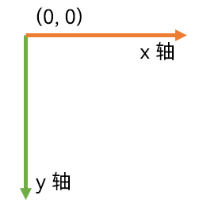
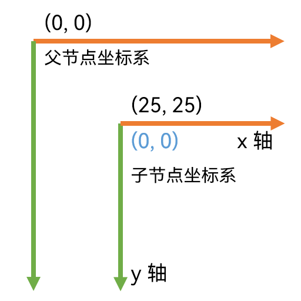

# Node（节点）

::: details 目录

[[toc]]

:::

JavaFX `Node` 类 —— `javafx.scene.Node`，是添加到 [JavaFX 场景图](../core/scene.md/#场景图-scene-graph) 的所有组件的基类（超类 / 父类）。JavaFX Node 类是抽象的，因此您只能将 Node 类的实现类添加到场景图中（抽象类无法实例化）。场景图中的所有 JavaFX Node 实例共享一组由 JavaFX Node 类定义的公共属性。这些通用属性将在本 JavaFX 节点教程中介绍。

The JavaFX `Node` class, `javafx.scene.Node`, is the base class (superclass) for all components added to the [JavaFX Scene Graph](../core/scene.md/#场景图-scene-graph). The JavaFX Node class is abstract, so you will only add subclasses of the Node class to the scene graph. All JavaFX Node instances in the scene graph share a set of common properties which are defined by the JavaFX Node class. These common properties will be covered in this JavaFX Node tutorial.

## `Node` 基础知识

每个 JavaFX 节点（实现类）实例只能添加到 JavaFX 场景图中**一次**。换句话说，每个 Node 实例只能出现在场景图中的一个地方。如果您尝试将相同的 Node 实现类实例多次添加到场景图中，JavaFX 将抛出异常！

Each JavaFX Node (subclass) instance can only be added to the JavaFX scene graph **once**. In other words, each Node instance can only appear in one place in the scene graph. If you try to add the same Node instance, or Node subclass instance, to the scene graph more than once, JavaFX will throw an exception!

JavaFX 节点有时可以有子节点（subitems / children）。给定的 Node 实例是否可以有子节点取决于具体的 Node 子类。JavaFX Node 的一个特殊子类名为 `Parent`（它也是一个抽象类），用于对可以有子节点的 Node 实例进行抽象。因此，可以有子节点的 Node 实例通常是 Parent 类的实现类的实例 —— 而不是直接实现 Node 类。

A JavaFX Node can sometimes have subitems - which are also called children. Whether a given Node instance can have children or not depends on the concrete Node subclass. A special subclass of JavaFX Node named `Parent` is used to model Node instance which can have children. Thus, Node instances that can have children are typically children of the Parent class - and not the Node class directly.

[JavaFX Stage](../core/stage.md) 和 [JavaFX Scene](../core/scene.md) 类不是 JavaFX Node 类的子类。虽然这两个类用于显示 JavaFX 场景图，但只有添加到 JavaFX Scene 实例的 Node 实例才会被视为 JavaFX 场景图的一部分。

The [JavaFX Stage](../core/stage.md) and [JavaFX Scene](../core/scene.md) classes are not subclasses of the JavaFX Node class. While these two classes are used to display the JavaFX scene graph, only Node instances added to a JavaFX Scene instance are considered part of the JavaFX Scene graph.

将 Node 实例附加到场景图后，仅允许管理 JavaFX 场景图的线程 —— JavaFX 应用程序线程修改 Node 实例。

Once a Node instance is attached to the scene graph, only the JavaFX Application Thread, the thread managing the JavaFX scene graph, is allowed to modify the Node instance.

## `Node` 属性（Properties）

JavaFX Node 类以及 Node 的所有子类具有以下公共属性：

The JavaFX Node class, and thus all subclasses of Node, has the following common properties:

- 笛卡尔坐标系（A cartesian coordinate system）
- 由以下内容分隔的边界框
  - 布局边界（Layout bounds）
  - 本地边界（Bounds in local）
  - 父节点的边界（Bounds in parent）
- layoutX
- layoutY
- 首选高度（Preferred height）
- 首选宽度（Preferred width）
- 最小高度（Minimum height）
- 最小宽度（Minimum width）
- 最大高度（Maximum height）
- 最大宽度（Maximum width）
- 用户数据（User data）
- 项（子节点）（Items (Child nodes)）

这些属性都将在后续教程中介绍。

Each of these properties will be covered in subsequent sections.

## `Node` 坐标系（Coordinate System）

每个 JavaFX 节点都有自己的笛卡尔坐标系。与常规笛卡尔坐标系的唯一区别是 Y 轴是相反的。也就是说，坐标系的原点在坐标系的左上角。随着 Y 值的增加，该点从坐标系的顶部向下移动。Y 轴的这种反转在 2D 图形坐标系中是非常常见的。

Each JavaFX Node has its own cartesian coordinate system. The only difference from a regular cartesian coordinate system is that the Y axis is reversed. That means, that the origo of the coordinate system is in the upper left corner of the coordinate system. As Y values increase, the point moves down from the top of the coordinate system. This reversal of the Y axis is normal in 2D graphics coordinate systems.



JavaFX 节点可以具有负的 X 和 Y 坐标。

It is possible for a JavaFX Node to have negative X and Y coordinates.

每个节点都有自己的坐标系。此坐标系用于在父节点内定位子节点实例，或者在 JavaFX Canvas（画布）中绘图时使用。这意味着，作为另一个节点的子节点的节点都有自己的坐标系，以及在其父节点坐标系中的位置 `(X,Y)`。

Each Node has its own coordinate system. This coordinate system is used to position child Node instances within the parent Node, or when drawing on a JavaFX Canvas. That means, that a Node that is a child of another Node both has its own coordinate system, and a location `(X,Y)` within its parent Node's coordinate system.

以下是父节点坐标系的示例，其中子节点位于父节点坐标系中的 `(25,25)` 坐标处。子节点也有它自己的坐标系，它有它的 `(0,0)` 坐标，子节点在父坐标系中的位置 —— 也就是是在父节点坐标系中的 `(25,25)` 坐标位置处。

Below is an example of a parent Node coordinate system in which a child Node is located at `(25,25)` in the parent Node coordinate system. The child Node also has its own coordinate system which has its `(0,0)` where the child Node is located in the parent coordinate system - meaning at `(25,25)` in the parent Node coordinate system.



## `Node` 边界框（Bounding Box）

JavaFX 节点有一个 _边界框_。JavaFX 节点的边界框是围绕节点形状的逻辑框。完整的节点位于边界框内 —— 从图形上看就是这样。 换句话说，节点的所有角（corners）和边缘（edges）都包含在这个边界框内，并且节点周围没有额外的空间，除非通过效果（effect）、填充（padding）或其它应用于节点的东西添加。

A JavaFX Node has a _bounding box_. The bounding box of a JavaFX Node is a logical box around the shape of the Node. The full Node is located inside the bounding box - graphically that is. In other words, all corners and edges of the Node is contained within the bounding box, and there is no extra space around the Node, unless added via an effect, padding or something else applied to the Node.

实际上，一个节点有 3 种边界框：

Actually, a Node has 3 bounding boxes:

|              名称              | 介绍                                                                                                                                                                                  |
| :----------------------------: | :------------------------------------------------------------------------------------------------------------------------------------------------------------------------------------ |
|    布局边界（layoutBounds）    | 节点在其自己的坐标空间中的边界 —— 未应用任何效果、剪切或变换（The bounds of the Node in its own coordinate space - without any effects, clip or transformations applied）             |
|   本地边界（boundsInLocal）    | 节点在其自己的坐标空间中的边界 —— 应用了效果和剪切，但没有应用变换（The bounds of the Node in its own coordinate space - with effects and clip applied, but without transformations） |
| 父节点的边界（boundsInParent） | 节点在其父坐标空间中的边界 —— 应用了效果、剪切和变换（The bounds of the Node in its parent coordinate space - with effects, clip and transformations applied）                        |

每一个这些边界框种类都可以从它们对应具有相同名称的属性中读取，也就是名为 `layoutBounds`、`boundsInLocal` 和`boundsInParent` 的属性。

Each of these bounding box dimensions can be read from their corresponding properties with the same name, meaning properties named `layoutBounds`, `boundsInLocal` and `boundsInParent`.

父节点（Parent）使用 `boundsInParent` 边界框来布局其子节点。父节点需要知道总空间，包括子节点的所有效果、剪辑和变换，以便能够为其分配空间。

The `boundsInParent` bounding box is used by the parent Node (Parent) to layout its children. The parent Node needs to know the total space including all effects, clip and transformations of a Node in order to be able to allocate space for it.

## `layoutX` 和 `layoutY` 属性

JavaFX 节点对象的 `layoutX` 和 `layoutY` 属性包含其父节点内部的节点的 X 和 Y 坐标。换句话说，layoutX 和 layoutY 是从父节点的 `(0,0)`（原点）的偏移量。

The `layoutX` and `layoutY` properties of a JavaFX Node object contain the X and Y of the Node inside of its parent. In other words, layoutX and layoutY are the offsets from the `(0,0)` (origin) of the parent Node.

并非所有布局类都会遵循节点的 layoutX 和 layoutY。这取决于父节点确切的布局算法是什么。

Not all layout classes will respect the layoutX and layoutY of a Node. It depends on what the exact layout algorithm of the parent Node is.

```java
node.setLayoutX(100);
node.setLayoutY(200);
```

## 首选宽度和高度（Preferred Width and Height）

JavaFX Node 对象的首选宽度和高度属性指定给定 Node 对象（通常是 Node 的子类）的首选宽度和高度。并非所有的父节点类都会遵循子节点的 `preferredWidth` 和 `preferredHeight`。这取决于具体的父节点实现。

The preferred width and height properties of a JavaFX Node object specify the preferred width and height of the given Node object (subclass of Node normally). Not all parent Node classes will respect the `preferredWidth` and `preferredHeight` of a child Node. It depends on the concrete parent Node implementation.

```java
node.setPrefWidth(100);
node.setPrefHeight(100);
```

## 最小宽度和高度（Minimum Width and Height）

JavaFX 节点对象的最小宽度和高度属性指定节点希望（或需要）显示自身的最小宽度和高度。并非所有的父节点类都会遵循这些属性。这取决于具体的父节点实现。

The minimum width and height properties of a JavaFX Node object specify the minimum width and height a Node wants (or needs) to display itself. Not all parent Node classes may respect these properties. It depends on the concrete parent Node implementation.

```java
node.setMinWidth(50);
node.setMinHeight(50);
```

## 最大宽度和高度（Maximum Width and Height）

JavaFX 节点对象的最大宽度和高度属性指定节点希望（或需要）显示自身的最大宽度和高度。并非所有的父节点类都会遵循这些属性。这取决于具体的父节点实现。

The maximum width and height properties of a JavaFX Node object specify the maximum width and height a Node wants (or needs) to display itself. Not all parent Node classes may respect these properties. It depends on the concrete parent Node implementation.

```java
node.setMaxWidth(50);
node.setMaxHeight(50);
```

## 用户数据（User Data）

您可以使用 `setUserData()` 方法在 JavaFX 节点上设置用户数据。此方法的参数可以是任何您选择的 Java 对象。这样你可以附加例如 业务对象到 JavaFX 节点实例。这是将一些用户数据附加到 Node 实例的示例：

You can set user data on a JavaFX node using the `setUserData()` method. This method takes any Java object of your own choosing. This way you can attach e.g. business objects to JavaFX Node instances. Here is an example of attaching some user data to a Node instance:

```java
node.setUserData(new MyObject("Hey - some data"));
```

## 项或子节点（Items or Child Nodes）

大部分 JavaFX 节点的子类可以包含项或子节点。您添加和访问这些子节点的具体方式取决于具体的节点类的子类。一些类有一个 `getItems()` 方法返回一个项目列表；一些类有一个 `getChildren()` 方法做同样的事情。您将必须检查具体的 Node 子类以了解它是否可以具有项或子节点，以及如何添加和访问它们。

Many JavaFX Node subclasses can contain items or child nodes. How exactly you add and access these child Nodes depends on the concrete Node subclass. Some classes have a `getItems()` method returning a List of the items. Other classes have a `getChildren()` method doing the same. You will have to check the concrete Node subclass to find out if it can have items or child nodes, and how you add and access them.
