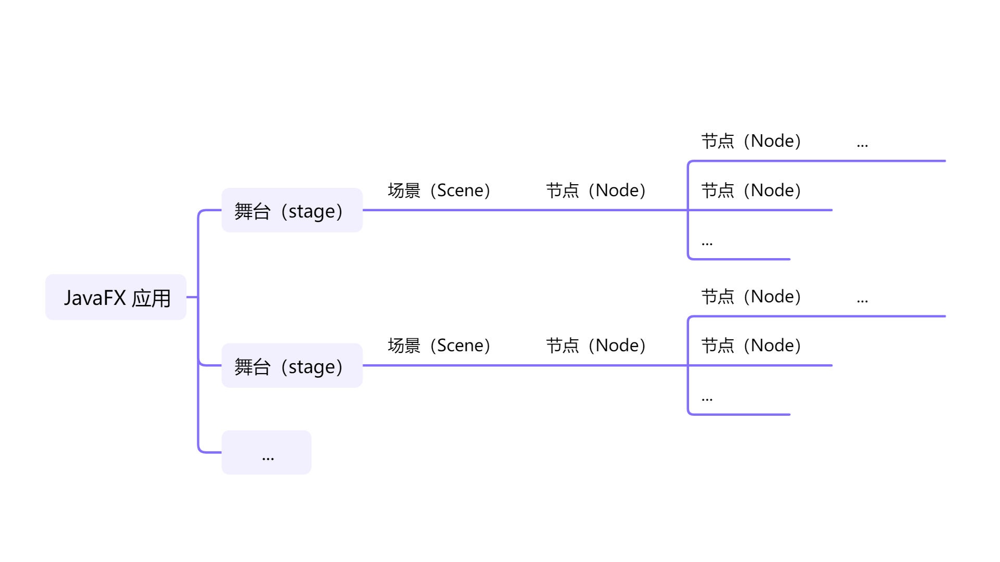

# JavaFX 概述

::: details 目录

[[toc]]

:::

要从使用 JavaFX 开发中充分受益，了解 JavaFX 的设计方式以及对 JavaFX 包含的功能有一个很好的概述是很有用的。 本文的目的是为您提供 JavaFX 概述。本文将首先介绍一般的 JavaFX 设计，然后再介绍 JavaFX 中的各种特性。

To fully benefit from JavaFX it is useful to understand how JavaFX is designed, and to have a good overview of what features JavaFX contains. The purpose of this text is to give you that JavaFX overview. This text will first look at the general JavaFX design, then look at the various features in JavaFX.

如果您熟悉 Flash / Flex，您会发现 JavaFX 在某种程度上受到了 Flash / Flex 的启发。JavaFX 中也有一些相同的想法。

If you are familiar with Flash / Flex, you will see that JavaFX is somewhat inspired by Flash / Flex. Some of the same ideas are found in JavaFX.

一般来说，JavaFX 应用程序包含一个或多个对应于窗口的舞台（stage）。每个舞台都有一个场景（scene）。每个场景都可以有一个包含控件（control）、布局（layout）等等节点（node）的对象图，称为场景图（scene graph）。这些概念都将在后面更详细地解释。下面是 JavaFX 应用程序的一般结构的图示：

In general, a JavaFX application contains one or more stages which corresponds to windows. Each stage has a scene attached to it. Each scene can have an object graph of controls, layouts etc. attached to it, called the scene graph. These concepts are all explained in more detail later. Here is an illustration of the general structure of a JavaFX application:

## 舞台（Stage）

舞台是 JavaFX 应用程序的外部框架。一个舞台通常对应于一个窗口。在 JavaFX 可以在浏览器中运行的早期阶段，舞台也可以指网页内 JavaFX 可用于绘制自身的区域。

The stage is the outer frame for a JavaFX application. The stage typically corresponds to a window. In the early days where JavaFX could run in the browser, the stage could also refer to the area inside the web page that JavaFX had available to draw itself.

自从浏览器停止对 Java 插件的支持，JavaFX 主要用于桌面应用程序。 在这里，JavaFX 取代了 Swing 作为推荐的桌面 GUI 框架。 而且我必须说，JavaFX 看起来比 Swing 更加一致且功能丰富。

Since the deprecation of the Java browser plugin JavaFX is mostly used for desktop applications. Here, JavaFX replaces Swing as the recommended desktop GUI framework. And I must say, that JavaFX looks a whole lot more consistent and feature rich than Swing.

在桌面环境中使用时，JavaFX 应用程序可以打开多个窗口。 每个窗口都有自己的舞台。

When used in a desktop environment, a JavaFX application can have multiple windows open. Each window has its own stage.

每个舞台都由 JavaFX 应用程序中的 `Stage` 对象表示。 JavaFX 应用程序有一个由 JavaFX 运行时为您创建的主要 `Stage` 对象。 如果 JavaFX 应用程序需要打开额外的窗口，它可以创建额外的 `Stage` 对象。 例如用于对话框、向导等。

Each stage is represented by a `Stage` object inside a JavaFX application. A JavaFX application has a primary `Stage` object which is created for you by the JavaFX runtime. A JavaFX application can create additional `Stage` objects if it needs additional windows open. For instance, for dialogs, wizards etc.

## 场景（Scene）

要在 JavaFX 应用程序的舞台上显示任何内容，您需要一个场景。一个舞台一次只能显示一个场景，但可以在运行时切换场景。就像剧院中的舞台可以重新安排以在戏剧表演期间显示多个场景一样，JavaFX 中的舞台对象可以在 JavaFX 应用程序的生命周期内显示多个场景（一次一个）。

To display anything on a stage in a JavaFX application, you need a _scene_. A stage can only show one scene at a time, but it is possible to exchange the scene at runtime. Just like a stage in a theater can be rearranged to show multiple scenes during a play, a stage object in JavaFX can show multiple scenes (one at a time) during the life time of a JavaFX application.

您可能想知道为什么 JavaFX 应用程序的每个舞台会有多个场景。想象一个电脑游戏。一个游戏可能有多个“屏幕”向玩家显示。例如，初始菜单屏幕、主游戏屏幕（玩游戏的地方）、游戏结束屏幕和分数结算屏幕。这些屏幕中的每一个都可以由不同的场景来表示。当游戏需要从一屏切换到下一屏时，只需将相应的场景附加到 JavaFX 应用程序的 Stage 对象即可。

You might wonder why a JavaFX application would ever have more than one scene per stage. Imagine a computer game. A game might have multiple "screens" to show to the user. For instance, an initial menu screen, the main game screen (where the game is played), a game over screen and a high score screen. Each of these screens can be represented by a different scene. When the game needs to change from one screen to the next, it simply attaches the corresponding scene to the `Stage` object of the JavaFX application.

场景由 JavaFX 应用程序中的 `Scene` 对象表示。JavaFX 应用程序必须创建它需要的所有 `Scene` 对象。

A scene is represented by a `Scene` object inside a JavaFX application. A JavaFX application must create all `Scene` objects it needs.

### 场景图（Scene Graph）

所有视觉组件（控件、布局等）都必须附加到要显示的场景，并且该场景必须附加到舞台才能使整个场景可见。附加到场景的所有控件、布局等的总对象图称为场景图。

All visual components (controls, layouts etc.) must be attached to a scene to be displayed, and that scene must be attached to a stage for the whole scene to be visible. The total object graph of all the controls, layouts etc. attached to a scene is called the _scene graph_.

### 节点（Nodes）

附加到场景图的所有组件都称为节点。所有节点都是名为 `javafx.scene.Node` 的 JavaFX 类的子类。

All components attached to the scene graph are called _nodes_. All nodes are subclasses of a JavaFX class called `javafx.scene.Node` .

有两种类型的节点：分支节点和叶节点。分支节点是可以包含其他节点（子节点）的节点。分支节点也称为父节点，因为它们可以包含子节点。叶节点是不能包含其他节点的节点。

There are two types of nodes: Branch nodes and leaf nodes. A branch node is a node that can contain other nodes (child nodes). Branch nodes are also referred to as parent nodes because they can contain child nodes. A leaf node is a node which cannot contain other nodes.

## 控件（Controls）

JavaFX 控件是在 JavaFX 应用程序中提供某种控制功能的 JavaFX 组件。例如，按钮、单选按钮、表格、树等等。

JavaFX controls are JavaFX components which provide some kind of control functionality inside a JavaFX application. For instance, a button, radio button, table, tree etc.

为了使控件可见，它必须附加到某个 `Scene`对象的场景图中。

For a control to be visible it must be attached to the scene graph of some `Scene` object.

控件通常嵌套在一些用来管理控件相对于彼此的布局的组件中，称为 JavaFX 布局组件。

Controls are usually nested inside some JavaFX layout component that manages the layout of controls relative to each other.

JavaFX 包含以下控件：

JavaFX contains the following controls:

- Accordion（手风琴）
- [Button（按钮）](http://tutorials.jenkov.com/javafx/button.html)
- [CheckBox（复选框）](http://tutorials.jenkov.com/javafx/checkbox.html)
- ChoiceBox（选择框）
- ColorPicker（颜色选择器）
- ComboBox（组合框）
- DatePicker（日期选择器）
- [Label（标签）](http://tutorials.jenkov.com/javafx/label.html)
- ListView（列表显示）
- Menu（菜单）
- MenuBar（菜单栏）
- PasswordField（密码框）
- ProgressBar（进度条）
- [RadioButton](http://tutorials.jenkov.com/javafx/radiobutton.html)（单选按钮）
- Slider（滑块）
- Spinner（微调器）
- SplitMenuButton（拆分菜单按钮）
- SplitPane（拆分窗格）
- TableView（表视图）
- TabPane（选项卡窗格）
- TextArea（文本区域）
- [TextField（文本框）](http://tutorials.jenkov.com/javafx/textfield.html)
- TitledPane（标题窗格）
- [ToggleButton（切换按钮）](http://tutorials.jenkov.com/javafx/togglebutton.html)
- ToolBar（工具栏）
- TreeTableView（树表视图）
- TreeView（树视图）

这些控件都将在单独的文本中进行解释。

Each of these controls will be explained in separate texts.

## 布局（Layouts）

_JavaFX 布局_ 是包含其他组件的组件。布局组件管理嵌套在其中的组件的布局。JavaFX 布局组件有时也称为父组件，因为它们包含子组件，还因为布局组件是 JavaFX 类 `javafx.scene.Parent` 的子类。

_JavaFX layouts_ are components which contains other components inside them. The layout component manages the layout of the components nested inside it. JavaFX layout components are also sometimes called _parent components_ because they contain child components, and because layout components are subclasses of the JavaFX class `javafx.scene.Parent`.

布局组件必须附加到某个 `Scene` 对象的场景图才能可见。

A layout component must be attached to the scene graph of some `Scene` object to be visible.

JavaFX 包含以下布局组件：

JavaFX contains the following layout components:

- Group
- Region
- Pane（窗格）
- [HBox](http://tutorials.jenkov.com/javafx/hbox.html)
- [VBox](http://tutorials.jenkov.com/javafx/vbox.html)
- FlowPane（流窗格）
- BorderPane（边框窗格）
- StackPane（堆栈窗格）
- TilePane
- GridPane（网格窗格）
- AnchorPane
- TextFlow（文本流）

这些布局组件都将在单独的文本中进行介绍。

Each of these layout components will be covered in separate texts.

### 嵌套布局

可以将布局组件嵌套在其它布局组件中。这对于实现特定布局很有用。例如，要获得未在网格中布局、但实现多行都拥有不同的水平布局的组件，您可以在 VBox 组件内嵌套多个 HBox 布局组件。

It is possible to nest layout components inside other layout components. This can be useful to achieve a specific layout. For instance, to get horizontal rows of components which are not laid out in a grid, but differently for each row, you can nest multiple HBox layout components inside a VBox component.

## 图表（Charts）

JavaFX 带有一组内置的开箱即用的图表组件，因此您不必每次需要基本图表时都从头开始编写图表代码。

JavaFX comes with a set of built-in ready-to-use chart components, so you don't have to code charts from scratch everytime you need a basic chart.

JavaFX 包含以下图表组件：

JavaFX contains the following chart components:

- AreaChart（面积图）
- BarChart（条形图）
- BubbleChart（气泡图）
- LineChart（折线图）
- PieChart（饼形图）
- ScatterChart（散点图）
- StackedAreaChart（堆积面积图）
- StackedBarChart（堆积条形图）

## 2D 图形

JavaFX 包含可以轻松在屏幕上绘制 2D 图形的功能。

JavaFX contains features that makes it easy to draw 2D graphics on the screen.

## 3D 图形

JavaFX 包含可以轻松在屏幕上绘制 3D 图形的功能。

JavaFX contains features that makes it easy to draw 3D graphics on the screen.

## 音频

JavaFX 包含可以轻松在 JavaFX 应用程序中播放音频的功能。这通常在游戏或教育应用中很有用。

JavaFX contains features that makes it easy to play audio in JavaFX applications. This is typically useful in games or educational applications.

## 视频

JavaFX 包含可以轻松在 JavaFX 应用程序中播放视频的功能。这通常在流媒体应用程序、游戏或教育应用程序中很有用。

JavaFX contains features that makes it easy to play video in JavaFX applications. This is typically useful in streaming applications, games or educational applications.

## WebView

JavaFX 包含一个能够显示网页（HTML5、CSS 等）的 `WebView` 组件。 JavaFX `WebView` 组件基于 WebKit —— Chrome 和 Safari 中也使用的网页渲染引擎。

JavaFX contains a `WebView` component which is capable of showing web pages (HTML5, CSS etc.). The JavaFX `WebView` component is based on WebKit - the web page rendering engine also used in Chrome and Safari.

`WebView` 组件使得将桌面应用程序与 Web 应用程序混合成为可能。有时这很有用。例如，如果您已经有一个不错的 Web 应用程序，但需要一些只有桌面应用程序才能提供的功能 —— 例如磁盘访问、实现与 HTTP 以外的其它网络协议（例如 UDP、IAP 等）的通信。

The `WebView` component makes it possible to mix a desktop application with a web application. There are times where that is useful. For instance, if you already have a decent web application, but need some features which can only be provided sensibly with a desktop application - like disk access, communication with other network protocols than HTTP (e.g UDP, IAP etc.) .
