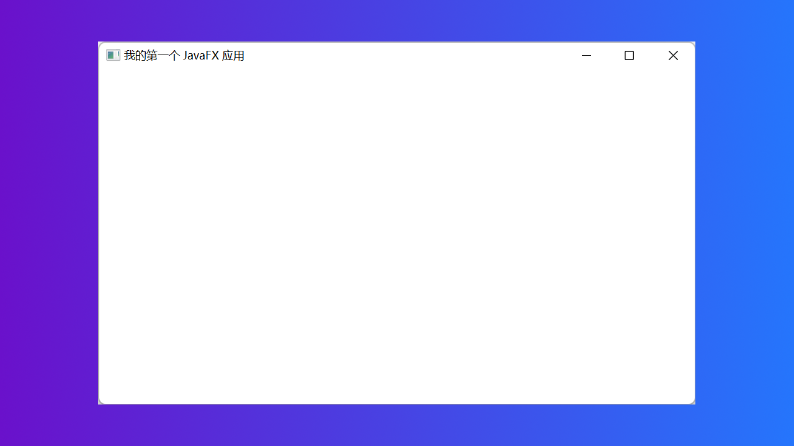
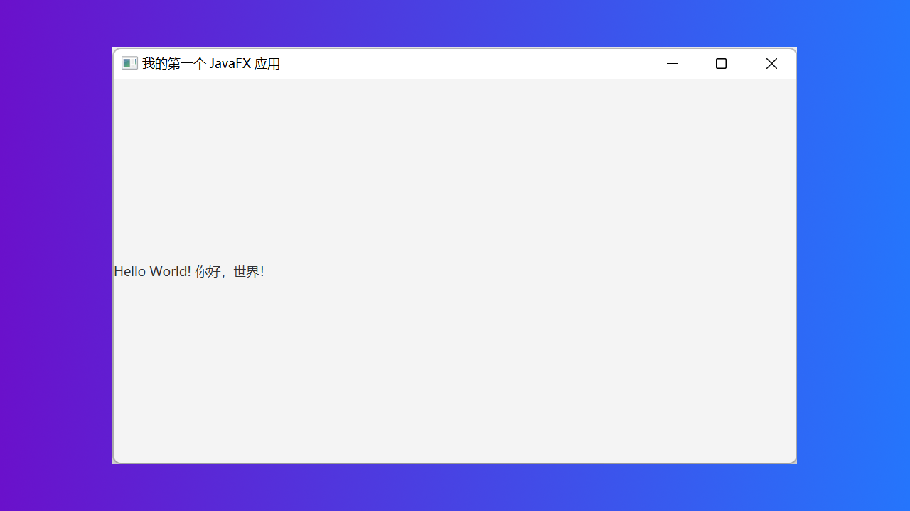

# 您的第一个 JavaFX 应用程序

::: details 目录

[[toc]]

:::

在本教程中，我将向您展示如何创建您的第一个 JavaFX 应用程序。因此，本教程不仅向您介绍核心 JavaFX 概念，也会提供一些 JavaFX 代码。您可以将其用作您自己的实验模板。

In this tutorial I will show you how to create your first JavaFX application. This tutorial thus serves both to introduce you to the core JavaFX concepts, as well as to give you a some JavaFX code you can use as template for your own experiments.

## JavaFX `Application` 类

JavaFX 应用程序需要一个主启动类。此类必须实现 `javafx.application.Application` 抽象类，该类是自 Java 8 以来 Java 中的标准类。

A JavaFX application needs a primary launch class. This class has to extend the `javafx.application.Application` class which is a standard class in Java since Java 8.

这是 `Application` 的示例实现类（还未实现方法）：

Here is an example subclass of `Application`:

```java{6-7}
package online.icekylin.helloworld;

import javafx.application.Application;
import javafx.stage.Stage;

public class MyFxApp extends Application {
}
```

## 实现 `start()` 方法

JavaFX `Application` 类的所有子类都必须实现 Application 类的 `start()` 抽象方法（或者成为 `Application` 本身的抽象子类）。

All subclasses of the JavaFX `Application` class must implement the abstract `start()` method of the `Application` class (or be an abstract subclass of `Application` itself).

当 JavaFX 应用程序启动时调用 `start()` 方法。这是上面的示例，但实现了 `start()` 方法：

The `start()` method is called when the JavaFX application is started. Here is the example from above, but with the `start()` method implemented:

```java{8-13}
package online.icekylin.helloworld;

import javafx.application.Application;
import javafx.stage.Stage;

public class MyFxApp extends Application {

    @Override
    public void start(Stage primaryStage) throws Exception {
        primaryStage.setTitle("我的第一个 JavaFX 应用");

        primaryStage.show();
    }

}
```

`start()` 方法有一个 `Stage`（舞台）类型的形参。该 `Stage` 类型的参数是显示 JavaFX 应用程序的所有可视部分的地方。`Stage` 对象由 JavaFX 运行时（JavaFX runtime）自动为您创建。

The `start()` method takes a single parameter of the type `Stage` . The stage is where all the visual parts of the JavaFX application are displayed. The `Stage` object is created for you by the JavaFX runtime.

上面的示例在 `Stage` 对象上设置了一个标题，然后对其调用 `show()`。这将使 JavaFX 应用程序的窗口以及窗口顶部栏中的标题可见。

The example above sets a title on the stage object and then calls `show()` on it. That will make the JavaFX application visible in a window with the title visible in the top bar of the window.

如果您不对 `Stage` 对象调用 `show()`，则什么都看不到且没有打开任何窗口。如果您的 JavaFX 应用程序在启动时不可见，请检查您是否记得从 `start()` 方法内部调用 `Stage` 对象的 `show()` 方法。

If you do not call `show()` on the stage object, nothing is visible. No window is opened. In case your JavaFX application does not become visible when launched, check if you have remembered to call the `Stage` `show()` method from inside `start()` .

## 添加一个 `main()` 方法

您实际上可以在没有 `main()` 方法的情况下启动 JavaFX 应用程序。但是，如果您想将命令行参数传递给应用程序，您需要添加一个 `main()` 方法。一般来说，我更喜欢添加一个 `main()` 方法，因为它使启动应用程序的代码更加明确。

You can actually launch a JavaFX application without a `main()` method. But, if you want to pass command line parameters to the application you need to add a `main()` method. In general I prefer to add a `main()` method because it makes it more explicit which code launches the application.

这是上面添加了 `main()` 方法的示例：

Here is the example from above with a `main()` method added:

```java{15-17}
package online.icekylin.helloworld;

import javafx.application.Application;
import javafx.stage.Stage;

public class MyFxApp extends Application {

    @Override
    public void start(Stage primaryStage) throws Exception {
        primaryStage.setTitle("我的第一个 JavaFX 应用");

        primaryStage.show();
    }

    public static void main(String[] args) {
        Application.launch(args);
    }

}
```

如您所见，`main()` 方法使用命令行参数调用 `launch()` 静态方法。`launch()` 方法是位于 `Application` 类中的静态方法。此方法启动 JavaFX 运行时和您的 JavaFX 应用程序。

As you can see, the `main()` method calls the static `launch()` method with the command line parameters. The `launch()` method is a static method located in the `Application` class. This method launches the JavaFX runtime and your JavaFX application.

`launch()` 方法将自动检测哪个类需要被调用，因此您不必明确告诉它要启动哪个类。

The `launch()` method will detect from which class it is called, so you don't have to tell it explicitly what class to launch.

这就是创建 JavaFX 应用程序所需的全部内容。这很简单，不是吗？现在您已经准备好开始使用 JavaFX 了！

That is really all it takes to create a JavaFX application. It is quite simple, isn't it? Now you are ready to start playing around with JavaFX !

这是运行上述 JavaFX 应用程序后打开的窗口的屏幕截图：

Here is a screenshot of the window being opened as a result of running the above JavaFX application:



## 添加场景 `Scene`

前面的 JavaFX 示例仅打开一个窗口，但在此窗口内没有显示任何内容。要在 JavaFX 应用程序窗口中显示某些内容，您必须将一个 `Scene`（场景）对象添加到 `Stage` 对象。这些步骤是在 `start()` 方法中完成的。

The previous JavaFX examples only open a window, but nothing is displayed inside this window. To display something inside the JavaFX application window you must add a `Scene` to the `Stage` object. This is done inside the `start()` method.

要在 JavaFX 应用程序中显示的所有组件都必须位于场景中。“舞台”和“场景”的名称灵感来自剧院。一个舞台可以展示多个场景，就像在戏剧中一样。类似地，电脑游戏可以有菜单场景、游戏场景、游戏结束场景、分数结算场景等。

All components to be displayed inside a JavaFX application must be located inside a scene. The names for "stage" and "scene" are inspired by a theater. A stage can display multiple scenes, just like in a theater play. Similarly, a computer game could have a menu scene, a game scene, a game over scene, a high score scene etc.

这是一个如何将 `Scene` 对象与简单的 `Label`（标签控件）对象一起添加到 `Stage` 的示例：

Here is an example of how to add a `Scene` object to the `Stage` along with a simple `Label`:

```java{14-16}
package online.icekylin.helloworld;

import javafx.application.Application;
import javafx.scene.Scene;
import javafx.scene.control.Label;
import javafx.stage.Stage;

public class MyFxApp extends Application {

    @Override
    public void start(Stage primaryStage) throws Exception {
        primaryStage.setTitle("我的第一个 JavaFX 应用");

        Label label = new Label("Hello World! 你好，世界！"); // 创建 Label 控件的实例
        Scene scene = new Scene(label, 640, 360);
        primaryStage.setScene(scene);

        primaryStage.show();
    }

    public static void main(String[] args) {
        Application.launch(args);
    }

}
```

此示例中添加了三行。首先创建一个标签对象。然后创建一个场景对象，将标签作为参数传递，以及两个表示场景宽度和高度的参数。

Three lines have been added to this example. First a Label object is created. Then a Scene object is created, passing the Label as parameter along with two parameters representing the width and height of the scene.

Scene 构造函数的第一个参数是场景图的根元素。场景图是一个类似于对象结构的图，包含要在 JavaFX 应用程序中显示的所有可视组件 - 例如 GUI 组件。

The first parameter of the Scene constructor is the root element of the scene graph. The scene graph is a graph like object structure containing all the visual components to be displayed in the JavaFX application - for instance GUI components.

`width` 和 `height` 参数设置 JavaFX 窗口打开时的宽度和高度，但用户可以调整窗口大小。

The width and height parameters sets the width and height of the JavaFX window when it opened, but the window can be resized by the user.

以下是添加了场景和标签后打开的窗口的外观：

Here is how the opened window looks with the Scene and Label added:


